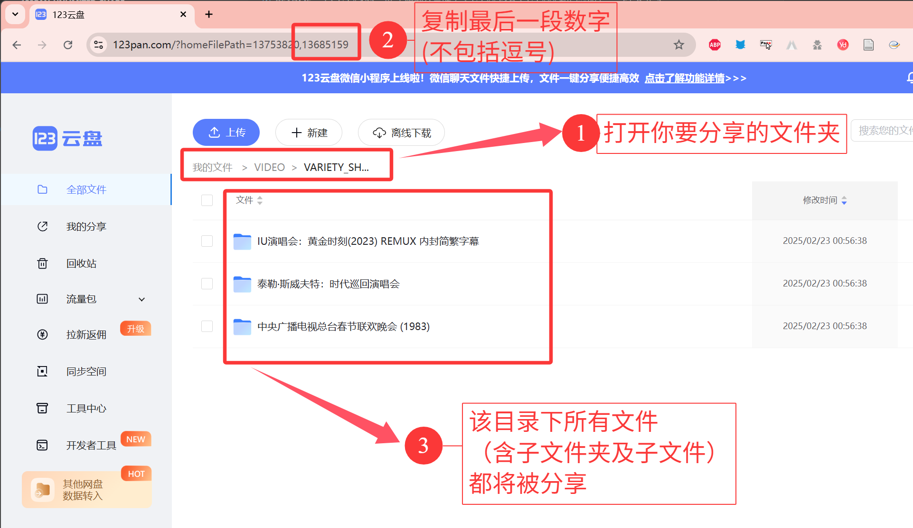

<!-- <p align="center">
  
</p> -->

# [123云盘](https://www.123pan.com) 无限制分享助手

## 免责声明

- **本项目仅供学习研究使用，请勿将本项目用于非法用途。**

## 这能做什么？

- 本助手的功能是：
  
    在**不创建分享链接**的情况下，实现分享文件的功能。

    人话：可以分享各种受限制的资源。

- 根据 123 云盘的分享政策：
    
    > 我们不会非法或非经授权地访问、使用、改变或披露您在123云盘的文件数据。**除非您主动分享**，或涉及法定监管事项，我们有权按照法律法规和有关监管机构规范性文件的规定对您通过123云盘传输、分享的文件数据，进行主动或依举报地审查、监督。
    
    也就是：**任何您分享（创建分享链接）的文件将会遭到内容审查**。然而，对于你自己上传、未分享的文件，只要有权机关不主动查你，123云盘**目前来说暂时不会**主动审查你的数据。

- **Update:** 受近期 [“剑网2025”专项行动](https://www.gov.cn/lianbo/bumen/202505/content_7023978.htm) 重点打击非法搬运、传播、售卖视听作品影响，[123云盘资源分享站](https://123.panbox.my/) 已停止运行。

## 如何使用？

### 准备

0. 安装 `Python`

1. 下载本项目

2. 安装依赖

    ```shell
    pip install tqdm pickle requests 
    ```

### 分享文件

1. **请确保所有文件都已上传到123云盘**

2. 修改 `run.py` 的内容

    ```python
    # 手机号/邮箱
    username = "13588886666"
    # 密码
    password = "123456"
    # 文件位置
    filePath = "./result.123share"
    # 模式："export" (分享) 或 "import" (导入)
    mode = "export"
    # 分享文件才需要的参数：文件夹ID (如果要分享整个网盘，填 0 )
    homeFilePath = 0 # 如果分享整个网盘, 速度会很慢
    ```

    - `homeFilePath` 可以通过 123 云盘的网页版获取 （见下方 [FAQ](#FAQ)）

3. 运行 `run.py`

    ```shell
    python run.py
    ```

4. 等待完成

5. 分享 `result.123share` 文件给他人

6. 控制台窗口长这样

    ```shell
    (py312) d:\123Pan-Unlimited-Share>python run.py
    获取文件列表中：parentFileId: 13712166
    获取文件列表中：parentFileId: 13712602
    获取文件列表中：parentFileId: 13712580
    获取文件列表中：parentFileId: 13712558
    获取文件列表中：parentFileId: 13712541
    获取文件列表中：parentFileId: 13712526
    获取文件列表中：parentFileId: 13712507
    获取文件列表中：parentFileId: 13712476
    获取文件列表中：parentFileId: 13712453
    获取文件列表中：parentFileId: 13712433
    获取文件列表中：parentFileId: 13712410
    获取文件列表中：parentFileId: 13712389
    获取文件列表中：parentFileId: 13712381
    获取文件列表中：parentFileId: 13712360
    获取文件列表中：parentFileId: 13712340
    获取文件列表中：parentFileId: 13712319
    获取文件列表中：parentFileId: 13712298
    获取文件列表中：parentFileId: 13712277
    获取文件列表中：parentFileId: 13712256
    获取文件列表中：parentFileId: 13712236
    获取文件列表中：parentFileId: 13712214
    获取文件列表中：parentFileId: 13712191
    获取文件列表中：parentFileId: 13712167
    导出完成, 保存到: ./恶搞之家全22季.123share
    导出成功
    ```

### 接收文件

1. 修改 `run.py` 的内容

    ```python
    # 手机号/邮箱
    username = "13588886666"
    # 密码
    password = "123456"
    # 文件位置
    filePath = "./result.123share"
    # 模式："export" (分享) 或 "import" (导入)
    mode = "import"
    ```

2. 运行 `run.py`

    ```shell
    python run.py
    ```

3. 等待完成

4. 进入 123云盘 根目录, 查看接收的文件

5. 控制台窗口长这样

    ```shell
    (py312) d:\123Pan-Unlimited-Share>python run.py
    100%|█████████████████████| 22/22 [00:09<00:00,  2.43it/s]
    100%|█████████████████████| 427/427 [03:05<00:00,  2.30it/s]
    导入完成, 保存到123网盘根目录中的: >>> 秒传文件_20250520102457_GitHub@realcwj <<< 文件夹
    导入成功
    ```

## 有没有接收文件的示例？

- 可以查看 [share](./share) 文件夹中的示例文件。

## 怎么实现的？

- 本项目是利用123云盘的 **秒传** 功能实现的。

- 具体而言：

  **TL;DR**: 在分享侧记录待分享文件的Hash；在接收侧使用同样的Hash模拟本地上传文件，上传时刚好命中服务器中已存在的文件，触发秒传。

  1. 确保即将分享的资源已经上传到 123 云盘 (网盘已存在数据)
  
  2. `export` 模式下, 程序会遍历文件夹内的所有内容，逐个获取每个文件的 Hash 值，将其保存到 `result.123share` 文件中

  3. `import` 模式下, 程序会读取 `result.123share` 文件中记录的文件数据，利用 123 云盘的 秒传 功能，将文件逐个上传到 123 云盘
  
  4. 此时，你保存的文件属于“由你自己上传”的性质，不属于文件分享、也不会被审查


## FAQ

### 如何获取 `homeFilePath` ?

1. 打开 123 云盘网页版

2. 打开你想分享的整个文件夹

3. 复制浏览器链接中的最后一部分数字

    

    - 如上图所示, 分享的文件夹ID为 `13685159`

### 是否会泄露我的隐私?

- 本项目不会泄露你的隐私，项目代码也已开源，供大家查看。

### 是否有分享的文件大小/数量限制？

- 无限制。可参考本项目中的 [2025年中央广播电视总台春节联欢晚会.10bit.2160p.DD5.1.HEVC.ts.123share](./share/2025年中央广播电视总台春节联欢晚会.10bit.2160p.DD5.1.HEVC.ts.123share) 大约 73G 的文件也可以分享。

### 速度慢怎么办？未来会不会使用多线程上传提速？

- 不能，123云盘的服务器有请求速率限制。

- 有得必有失，都给你绕过审查了，就耐心等待吧~

## License

本项目使用 [MIT License](LICENSE)。

**需要特别注意的是：**

> MIT License 要求您在保留 MIT License 原有的版权和许可权的前提下，**不得将本项目用于商业目的**。