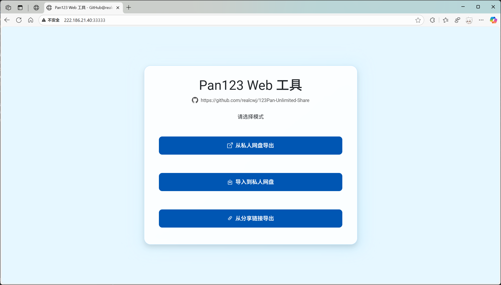
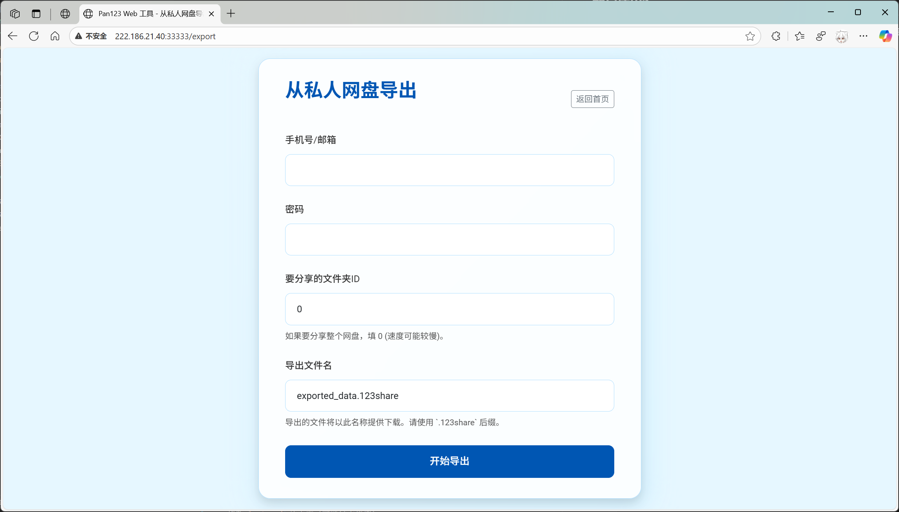
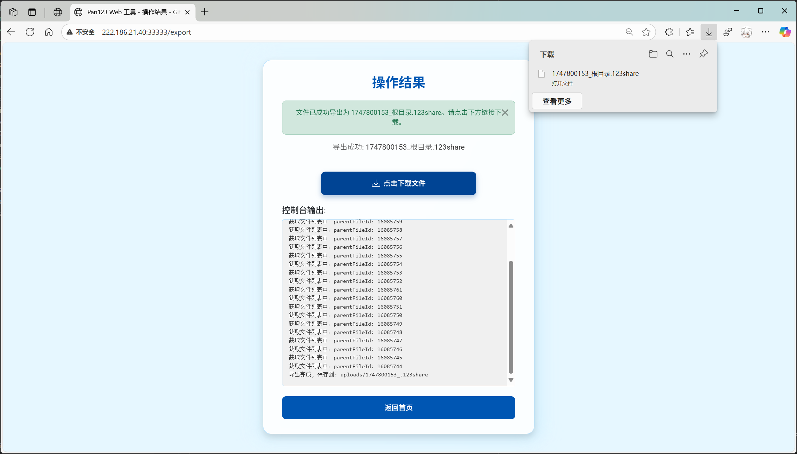
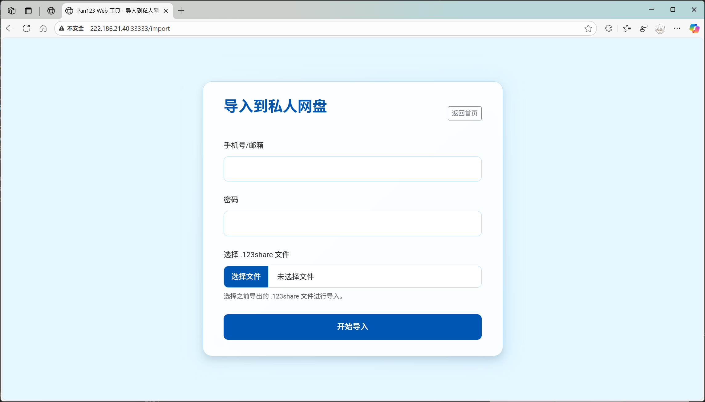
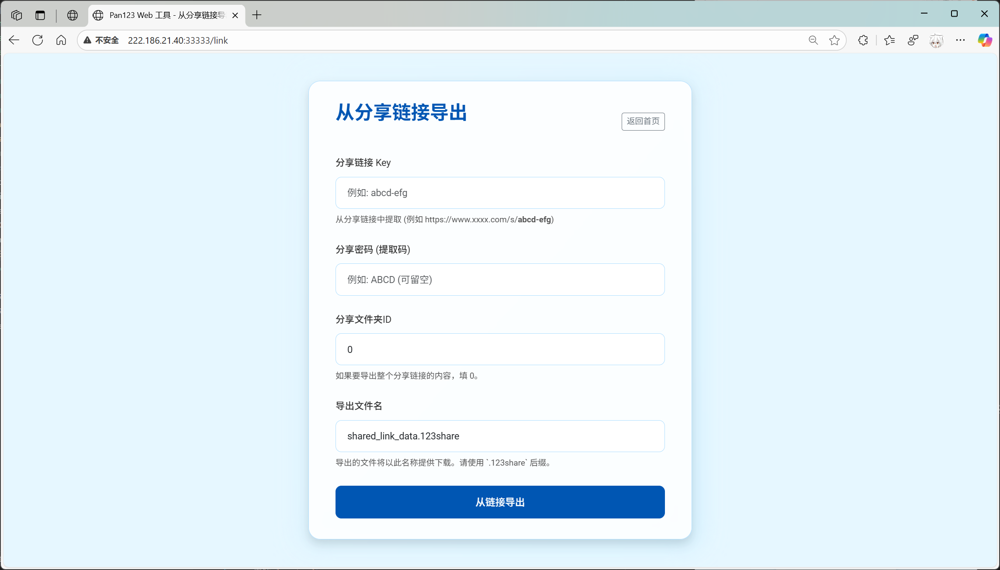
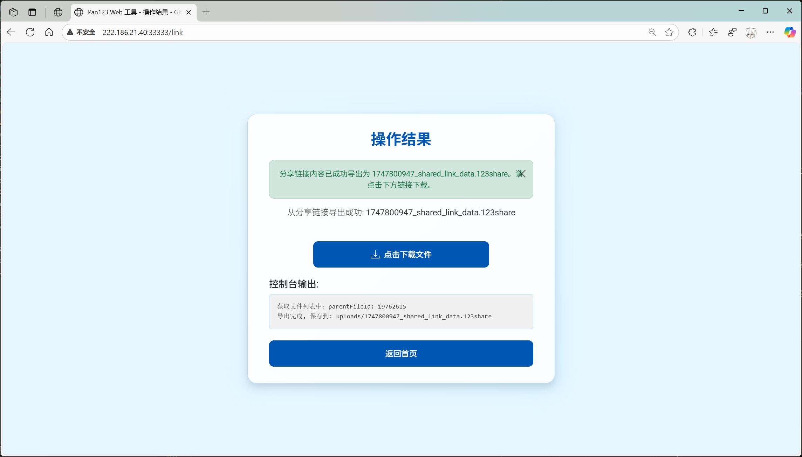

# [123云盘](https://www.123pan.com) 无限制分享工具

- 欢迎提 Pull Requests 和 **详细的可复现的** Issues 和 功能建议。

- **网站、代码已更新，文档还没写。抢先体验：[http://222.186.21.40:33333/](http://222.186.21.40:33333/)**

## 免责声明

- 受近期 [“剑网2025”专项行动](https://www.gov.cn/lianbo/bumen/202505/content_7023978.htm) 重点打击非法搬运、传播、售卖视听作品影响，[123云盘资源分享站](https://123.panbox.my/) 已停止运行，**本项目仅供学习研究使用，请勿将本项目用于非法用途。**

## 这个项目能做什么？

- 本项目的功能是：
  
    在**不创建分享链接**的情况下，实现分享文件的功能。
    
    受益于此，本项目可以不受内容审查、分享数量、文件大小、有效时间等因素的限制，分享各种资源。

- 根据 123 云盘的分享政策：
    
    > 我们不会非法或非经授权地访问、使用、改变或披露您在123云盘的文件数据。**除非您主动分享**，或涉及法定监管事项，我们有权按照法律法规和有关监管机构规范性文件的规定对您通过123云盘传输、分享的文件数据，进行主动或依举报地审查、监督。
    
    也就是：**任何您分享（创建分享链接）的文件将会遭到内容审查**。然而，对于你自己上传、未分享的文件，只要有权机关不主动查你，123云盘**目前来说暂时不会**主动审查你的数据。

## 核心功能

- 📄 支持分享单个文件（如仅需分享单个文件, 可使用 [Greasy Fork: 123云盘秒传链接](https://greasyfork.org/zh-CN/scripts/525210-123%E4%BA%91%E7%9B%98%E7%A7%92%E4%BC%A0%E9%93%BE%E6%8E%A5)）

- 📂 支持分享文件夹（批量分享），可用性更强

- ☁️ 支持 [从私人网盘导出](#使用教程) `*.123share` 文件（不创建分享链接、不会被审查）

- 🔗 支持 [从分享链接导出](#使用教程) `*.123share` 文件（兼容现有分享方式）

- 🎭 文件/文件夹 ID 匿名化 [[Issue #2]](https://github.com/realcwj/123Pan-Unlimited-Share/issues/2)，不暴露分享者的身份

- 🌐 提供基于 `Flask` 的 [可视化界面（网页）](#使用在线部署的可视化界面网页)

- 🚧 提供基于 `Python` 的 [调用脚本](#推荐本地运行-python-脚本)，可二次开发

- 🥳 免费、完整、开源的代码，**本地部署更安全~**

## 开发计划

- ♻️ 【已完成】导入/导出资源支持API调用（文档还没写）

- ☁️ 【已完成】分享码功能（同一个网站内分享文件，不再需要下载 `*.123share` 文件）

- ☁️ 【考虑中】从互联网目前存在的共享渠道自动爬取资源，实现资源共享（待定，可能有版权问题，欢迎提实现思路建议）

## 目录

- [123云盘 无限制分享工具](#123云盘-无限制分享工具)
  - [免责声明](#免责声明)
  - [这个项目能做什么？](#这个项目能做什么)
  - [核心功能](#核心功能)
  - [开发计划](#开发计划)
  - [目录](#目录)
  - [如何使用？](#如何使用)
    - [使用在线部署的可视化界面（网页）](#使用在线部署的可视化界面网页)
      - [使用教程](#使用教程)
    - [【推荐】本地部署可视化界面（网页）](#推荐本地部署可视化界面网页)
      - [一、准备](#一准备)
      - [二、启动](#二启动)
    - [【推荐】本地运行 Python 脚本](#推荐本地运行-python-脚本)
      - [一、准备](#一准备-1)
      - [二、从个人网盘分享文件](#二从个人网盘分享文件)
      - [三、从分享链接导出文件](#三从分享链接导出文件)
      - [四、接收文件](#四接收文件)
  - [目前分享了哪些文件？](#目前分享了哪些文件)
  - [原理是啥？怎么实现的？](#原理是啥怎么实现的)
  - [FAQ](#faq)
    - [如何获取 `homeFilePath` ?](#如何获取-homefilepath-)
    - [是否会泄露我的隐私?](#是否会泄露我的隐私)
    - [是否有分享的文件大小/数量限制？](#是否有分享的文件大小数量限制)
    - [导入速度慢怎么办？未来会不会使用多线程上传提速？](#导入速度慢怎么办未来会不会使用多线程上传提速)
    - [分享的文件是否会过期？](#分享的文件是否会过期)
  - [License](#license)

## 如何使用？

**⚠️重要提示：推荐本地部署网页/本地运行Python脚本，尽量避免使用他人搭建的网页，你永远不知道别人会不会在后台记录你的账号密码！**

### 使用在线部署的可视化界面（网页）

- 已在这里 [http://222.186.21.40:33333/](http://222.186.21.40:33333/) 搭建了一个网页版，供大家使用。

- **服务器很渣，大家轻点用，千万别给我上DDoS🥺**

#### 使用教程

1. 打开网页 [http://222.186.21.40:33333/](http://222.186.21.40:33333/)

2. 主界面如下

<p align="center">
  
</p>

3. `从私人网盘导出` 功能

<p align="center">
  
</p>

- **手机号/邮箱**：填写你123云盘的手机号/邮箱

- **密码**：填写你123云盘的密码

- **分享的文件夹ID**：填写你要分享的文件夹的ID，参考 [FAQ](#faq)

- **导出文件名**：填写你要导出的文件名（例如：`ABC.123share`，后续导入时，会以 `ABC` 作为导入的根目录文件名）

    随后，耐心等待程序运行，运行速度取决于分享的文件总数，并将输出的文件分享给他人。

<p align="center">
  
</p>

4. `导入到私人网盘` 功能

<p align="center">
  
</p>

- **手机号/邮箱**：填写你123云盘的手机号/邮箱

- **密码**：填写你123云盘的密码

- **选择 .123share 文件**：选择你要导入的 `*.123share` 文件。注意：文件名中的 `*` 部分会作为导入的根目录文件名

    随后，耐心等待程序运行，运行速度取决于接收的文件总数。

- **提示：导入文件数量过多，速度会比较慢，此时建议本地部署运行，可以实时查看进度。例如，导入5000个文件大约需要30分钟。您也可以关闭网页，导入过程会在后台继续进行。**

<p align="center">
  
</p>

<p align="center">
  
</p>

5. `从分享链接导出` 功能

<p align="center">
  
</p>

- **分享链接 Key**：例如，分享链接：`https://www.123456.com/s/abcd-efg`，此处填写末尾的 `abcd-efg` 部分

- **分享密码**：填写分享密码，如果没有密码就不填

- **导出文件名**：填写你要导出的文件名（例如：`ABC.123share`，后续导入时，会以 `ABC` 作为导入的根目录文件名）

    随后，耐心等待程序运行，运行速度取决于分享的文件总数，并将输出的文件分享给他人。

<p align="center">
  
</p>

### 【推荐】本地部署可视化界面（网页）

#### 一、准备

1. 安装 `Python`

2. 下载本项目

3. 安装依赖

    ```shell
    pip install tqdm requests flask
    ```

4. 修改 `web.py` 的内容（可跳过本步骤）

    ```python
    # 如果要自己部署，请修改这里的加密密钥
    app.secret_key = '114514'
    # 最大文件大小 (单位：字节)
    app.config['MAX_CONTENT_LENGTH'] = 1024 * 1024 * 10 # 这里是10MB
    # 运行端口
    app.run(debug=DEBUG, host='0.0.0.0', port=33333) # 这里是 33333 端口
    ```

#### 二、启动

1. 运行 `web.py`

    ```shell
    python web.py
    ```

2. 控制台窗口长这样

    ```shell
    (py312) d:\123Pan-Unlimited-Share>python web.py
    * Serving Flask app 'web'
    * Debug mode: off
    WARNING: This is a development server. Do not use it in a production deployment. Use a production WSGI server instead.
    * Running on all addresses (0.0.0.0)
    * Running on http://127.0.0.1:33333        <<< 访问连接在这里
    * Running on http://198.18.0.1:33333       <<< 访问连接在这里
    Press CTRL+C to quit
    ```

3. 打开浏览器，访问 `{host}:{port}`, 例如：`http://127.0.0.1:33333`

4. 网页内的操作同：[使用教程](#使用教程)

### 【推荐】本地运行 Python 脚本

#### 一、准备

1. 安装 `Python`

2. 下载本项目

3. 安装依赖

    ```shell
    pip install tqdm requests
    ```

#### 二、从个人网盘分享文件

1. **请确保所有文件都已上传到123云盘**

2. 修改 `run.py` 的内容

    ```python
    # 模式："export" (从私人网盘分享)
    mode = "export"

    # 文件位置
    #   建议填写完整路径：
    #   Windows系统（示例）:
    #       filePath = r"D:\123Pan-Unlimited-Share\share\result.123share"
    #                  ^ 注意引号前面有个r
    #   Linux系统（示例）:
    #       filePath = "/home/xxx/123Pan-Unlimited-Share/share/result.123share" 
    filePath = r"D:\123Pan-Unlimited-Share\share\result.123share"

    # 手机号/邮箱
    username = "13566668888"
    # 密码
    password = "ABCDabcd1234"

    # 要分享的文件夹ID (如果要分享整个网盘，填 0 , 但是速度会很慢)
    homeFilePath = 0
    ```

    - `homeFilePath` 可以通过 123 云盘的网页版获取 （见下方 [FAQ](#FAQ)）

3. 运行 `run.py`

    ```shell
    python run.py
    ```

4. 等待完成

5. 控制台窗口长这样

    ```shell
    (py312) d:\123Pan-Unlimited-Share>python run.py
    获取文件列表中：parentFileId: xxxxxxxx
    获取文件列表中：parentFileId: xxxxxxxx
    获取文件列表中：parentFileId: xxxxxxxx
    获取文件列表中：parentFileId: xxxxxxxx
    获取文件列表中：parentFileId: xxxxxxxx
    获取文件列表中：parentFileId: xxxxxxxx
    获取文件列表中：parentFileId: xxxxxxxx
    获取文件列表中：parentFileId: xxxxxxxx
    获取文件列表中：parentFileId: xxxxxxxx
    导出完成, 保存到: D:\123Pan-Unlimited-Share\share\result.123share
    导出成功
    ```

6. 分享 `result.123share` 文件给他人

#### 三、从分享链接导出文件

1. 修改 `run.py` 的内容

    ```python
    # 模式："link" (从分享链接导出)
    mode = "link"

    # 文件位置
    #   建议填写完整路径：
    #   Windows系统（示例）:
    #       filePath = r"D:\123Pan-Unlimited-Share\share\result.123share"
    #                  ^ 注意这里有个r
    #   Linux系统（示例）:
    #       filePath = "/home/xxx/123Pan-Unlimited-Share/share/result.123share" 
    filePath = r"D:\123Pan-Unlimited-Share\share\result.123share"

    # 示例分享链接：
    # https://www.******.com/s/abcd-efg
    # 提取码：ABCD
    # parentFileId = "0"        # 根目录填 0 , 如需分享指定目录需要从浏览器F12获取
    # shareKey = "abcd-efg"
    # sharePwd = "ABCD"

    # 分享文件夹ID (如果要导出整个分享链接的内容，填 0)
    parentFileId = "0"
    # 分享链接
    shareKey = "abcd-efg"
    # 分享密码
    sharePwd = "ABCD"
    ```

2. 运行 `run.py`

    ```shell
    python run.py
    ```

3. 等待完成

4. 控制台窗口长这样

    ```shell
    (py312) d:\123Pan-Unlimited-Share>python run.py
    获取文件列表中：parentFileId: xxxxxxxx
    100%|█████████████████████| 1/1 [00:00<?, ?it/s]
    100%|█████████████████████| 1/1 [00:00<?, ?it/s]
    导出完成, 保存到: D:\123Pan-Unlimited-Share\share\result.123share
    ```

5. 分享 `result.123share` 文件给他人

#### 四、接收文件

1. 修改 `run.py` 的内容

    ```python
    # 模式："import" (导入)
    mode = "import"

    # 文件位置
    #   建议填写完整路径：
    #   Windows系统（示例）:
    #       filePath = r"D:\123Pan-Unlimited-Share\share\result.123share"
    #                  ^ 注意这里有个r
    #   Linux系统（示例）:
    #       filePath = "/home/xxx/123Pan-Unlimited-Share/share/result.123share" 
    filePath = r"D:\123Pan-Unlimited-Share\share\result.123share"

    # 手机号/邮箱
    username = "13566668888"
    # 密码
    password = "ABCDabcd1234"
    ```

2. 运行 `run.py`

    ```shell
    python run.py
    ```

3. 等待完成

4. 进入 123云盘 根目录, 查看接收的文件

5. 控制台窗口长这样

    ```shell
    (py312) d:\123Pan-Unlimited-Share>python run.py
    100%|█████████████████████| 22/22 [00:09<00:00,  2.43it/s]
    100%|█████████████████████| 427/427 [03:05<00:00,  2.30it/s]
    导入完成, 保存到123网盘根目录中的: >>> result_GitHub@realcwj <<< 文件夹
    导入成功
    ```

- **注意：** 导入的文件夹名称为 `xxxxx.123share` 中的 `xxxxx` 部分。

## 目前分享了哪些文件？

- 目前所有分享的文件请看 [目录树（TREE.md）](https://raw.githubusercontent.com/realcwj/123Pan-Unlimited-Share/refs/heads/main/TREE.md)。（from: [酷安@一笔轻安](https://www.123865.com/s/gD58Vv-PFmHh)）

- 提醒：目录树的文件内容总共**19w**+行，加载前请确保电脑性能强劲，也可以在这里看 [精简版的文件目录树](https://raw.githubusercontent.com/realcwj/123Pan-Unlimited-Share/refs/heads/main/TREE_SHORT.md)。

- 分享的内容均存储在 [share](./share) 文件夹中。

## 原理是啥？怎么实现的？

**TL;DR**：在分享侧记录待分享文件的Hash；在接收侧使用同样的Hash模拟本地上传文件，上传时刚好命中服务器中已存在的文件，触发秒传。

- 本项目是利用123云盘的 **秒传** 功能实现的，具体而言：

1. 确保即将分享的资源已经上传到123云盘 (网盘已存在数据)

2. `export`/`link` 模式下, 程序会遍历指定文件夹内的所有内容，逐个获取每个文件的 Hash 值，使用 base64 加密后将其保存到 `*.123share` 文件中

3. `import` 模式下, 程序会读取 `*.123share` 文件中记录的文件数据，利用123云盘的秒传功能，将文件逐个上传到123云盘

4. 此时，你保存的这些文件属于“由你自己上传”的性质，不属于文件分享、也不会经过审查程序

## FAQ

### 如何获取 `homeFilePath` ?

1. 打开 123 云盘网页版

2. 打开你想分享的整个文件夹 (比如你要分享ABCD文件夹，那就点进去)

    这时候浏览器的网页链接应该是类似这样的：

   ```url
   https://www.123pan.com/?homeFilePath=12345678
   或者
   https://www.123pan.com/?homeFilePath=12345678,87654321
   ```

1. 复制浏览器链接中的最后一部分数字

    如上面的两个链接所示, 分享的文件夹ID分别为 `12345678` 和 `87654321`

### 是否会泄露我的隐私?

- 本项目不会泄露你的隐私，项目代码也已开源，供大家查看。

### 是否有分享的文件大小/数量限制？

- 无限制

- 可参考本项目中的 [2025年中央广播电视总台春节联欢晚会.10bit.2160p.DD5.1.HEVC.ts.123share](./share/2025年中央广播电视总台春节联欢晚会.10bit.2160p.DD5.1.HEVC.ts.123share) 大约 73G 的文件也可以分享。

### 导入速度慢怎么办？未来会不会使用多线程上传提速？

- 不能，123云盘的服务器有请求速率限制。

- 有得必有失，都给你绕过审查了，就耐心等待吧~

### 分享的文件是否会过期？

- 使用本项目分享的文件**理论上永不过期**。由于本项目的分享原理是记录文件的 Hash，因此，只要123云盘的服务器中存在源文件，分享将永久有效。

## License

本项目使用 [GPLv3 License](LICENSE)。